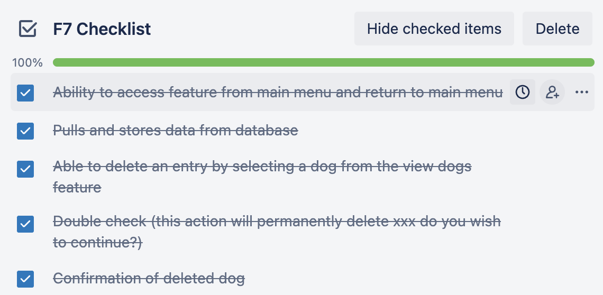
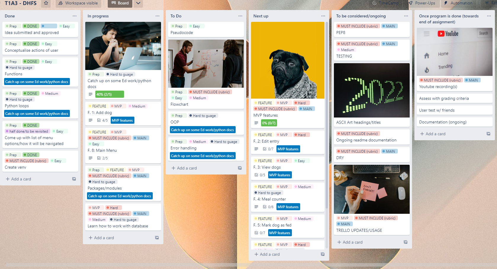
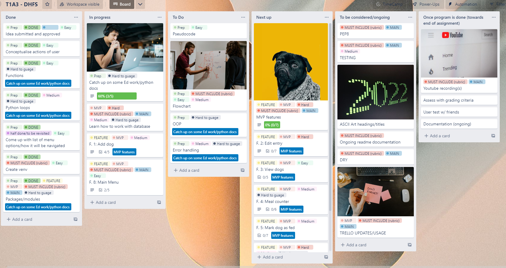

## [View the repo on GitHub](https://github.com/JRBoland/T1A3-Terminal-Application)
## [View the presentation](https://youtu.be/br5ZZiw67bY)

### Help documentation

This Python program uses Python 3. You can check if you have python installed by opening your systems terminal and entering the following command:
```python --version```

If you do not have Python installed, you can install it **[here](https://www.python.org/downloads/)**

### Starting the program

*Current startup instructions seem to have issues on some machines. If the instructions below do not work, please use the **GitHub codespaces** method below as a way of accessing and trying the program.*


1. Visit the **[projects GitHub repository](https://github.com/JRBoland/T1A3-Terminal-Application)** and click the green `< > Code` button, and click the green 'Create codespace on main' button.

2. In the Codespace, using the built-in terminal, type `bash src/run_app.sh`


3. The application should start. If you are met with an error, try typing `bash src/run_setup.sh` in the terminal prior to running `bash src/run_app.sh`

*If this method does not work, and the other methods listed do not work, please contact me*

### General startup

1. Visit the **[projects GitHub repository](https://github.com/JRBoland/T1A3-Terminal-Application)** and click the green `< > Code` button, and download as a ZIP file. 


2. Extract the contents of the ZIP file and move the folder to somewhere recognizable (eg. desktop). Take note of the name of the folder, it *should* be `T1A3-Terminal-Application-main`. It may not have `-main` at the end.

3. In your terminal, navigate to the folder using the 'cd' command. If the folder is on your desktop, this may look like 
```cd desktop/t1a3-terminal-application-main```

4. Once you have navigated to the folder of the application, simply type `bash src/run_setup.sh` and the program should install the necessary package requirements 

5. After this, type `bash src/run_app.sh` to begin the app.

### The GitHub way

1. Visit the **[projects GitHub repository](https://github.com/JRBoland/T1A3-Terminal-Application)** and click the green `< > Code` button and copy the text provided when HTTP is selected.


2. Navigate to the folder you would like the file to be cloned into and clone the repository from GitHub using the text copied from above.

```git clone https://github.com/JRBoland/T1A3-Terminal-Application.git```

3. Navigate to the folder that was cloned 

```cd t1a3-terminal-application```

4. Type `bash src/run_setup.sh` and the program should have installed the necessary requirements and `bash src/run_app.sh` to run the app. 

# Dog Shelter Feeding Helper

- Application to manage a dog shelter’s daily feeding schedule - keeping track of the feeding & the dietary information of dogs that come in.
- *The ‘fed’ status of the dog will reset each day*. The dogs name & information will be assigned a ‘DoggyID’ and remain in the database until it has been deleted (adopted).
    
## List of features
    
1. **Continuity message to indicate to user if fed count has been reset.**
        
    
        
    
        
    - On opening the application, a message will indicate if the fed count has been reset (new day) or carried on from last session (same day)
    - Using a separate file `date.txt`, a date in `%a %b %d` format (eg. Sat Dec 17) will be checked and compared with the systems date in the same format.
        
    
        
    - Using `if` statements, the fed counter remains the same from the last session if the dates match, aka it is the same day. The fed counter variable will reset to 0 if it recognises that it is a new day, done by changing all of the ‘Fed’ key values from ‘Yes’ to ‘No’ in the json file `dogsdb.json` on recognition of it being a different date. In both situations regardless, `date.txt` is written over and replaced with the current date at time of use.

    

    
    

2. **Display of count of dogs in shelter, count of dogs that have been fed** (eg. 15/20 dogs have been fed today). *Count of dogs that have been fed will reset on a new day.*
        
    
        
    
        
    - Shows current date and time using `datetime` from the in built python module. 
    - If all dogs are fed, the user gets a message on the display indicating that all dogs have been fed today. 
    - Uses pyfiglet to create a more ‘eye catching’ counter for the user. 
        
    
        

3. **Menu to view which actions the user wishes to take. Entering an input takes the user to that menu option.**
        
    
        
    - Includes some error handling to catch index or value errors, accounting for the user inputting an invalid option.
        
    
        

**Menu options include:**

4. **View dogs & information (including dietary requirements/ in readable format)**
        
    
        
    
        
    - Uses `tabulate` to show the dogs in an easily viewable format, looping through and pulling the key value pairs stored in the `dogsdb.json` file.
    

5. **Add a dog & its information to the database** 
        
    
        
    
        
    
        
    - User can add a new dog to the shelter, entering its ‘name’, ‘breed’, ‘medical and dietary requirements’ (yes/no), ‘details of medical & dietary requirement’ and whether or not the dog has been ‘fed’. This information is stored in the dictionary format (in the case of the add dog menu; ‘prompt’: ‘answer’) and is stored in a separate json file `dogsdb.json` and used in conjunction with the python package `tinydb`. 
    - User can exit back to main menu at any time by typing exit.
    - *Nice to have* next addition would be to have empty answers return “N/A” or something to that effect. User should also be able to exit using “0” with future updates to functionality. Additionally, a user can currently input a new record which is all empty. This issue needs to be fixed.
        

6. **Edit dog information in database**
        
    
        
    
        
    - Using view dogs from above, the user can enter in an identifier ‘DoggyID’ to select a dog from the database and change their information. 
    - Using tinydb, a record is matched.
    - User then gets a secondary menu with prompts of which key value they would like to change. Users new response overrides previous value for the selected key (menu option), which is then updated in the database.
    - User receives confirmation of update. 
    

7. **Update the fed status of a dog**

    

    - Very similar process to menu option 3, however streamlined to update fed status. As with all other ways to update the fed status of the dogs, changing ‘fed’ value will update the fed count display. Displays ‘view dogs’ table to see dogs and their fed status. 
    - User gets yes/no option to update a dogs fed status.
    - New page appears confirming change of value.
    

8. **View dogs still to be fed**
        
    
        
    
        
    - Returns the dogs that need to be fed, and gives the user the option to go to the ‘mark dog as fed’ menu option or return to main menu.
    - Uses same functionality as view dogs menu option, however filters out to only show dogs with the ‘Fed’ key value of ‘No’. 


9. **Remove a dog from the shelter**
        
    
        
    

    - Gives the user the ability to remove a dog from the database/shelter. User is able to enter in a ‘DoggyID’ of an entry that they wish to remove from the shelter. Doing so will remove the entry from the database in `dogsdb.json`. 
    - Uses view dogs from menu option 1 to showcase dogs in shelter.
    - User will be given two forms of confirmation, the first being to hit `enter` if their ‘DoggyID’ choice is correct, and finally to enter a ‘y / n’ response to confirm its permanent deletion. Different forms of confirmation used so that the user has to do something ‘different’ to confirm the deletion of the entry. 
    

10. **Exit the application**

    - Allows the user to exit the terminal after displaying a goodbye message to the user.
    

    ***Additional notes***

    The notion of it being a dog shelter can be interchanged (ie. the application could also work for a dogsitter that looks after a lot of dogs..?) alternatively, a similar model could be used for something like a nursing home medication tracker with some slight change in variables (nursing home residents profile, breakfast, lunch, dinner medication), or kindergarten/boarding school/special needs school meal/feeding schedule.
    
    - *Nice to have additions*:
        - Different shelter locations, each with a database of their own animals
        - Search for dog by name, type or dietary requirement/medication
        - Adding of dog weight and meal size variable
        - View *which type of dietary requirements* are required as part of the how many meals/& how many have dietary requirements menu option
        - Change to an ‘animal’ shelter, incorporating different animals (not just dogs) which can be a new variable to sort/view by. Inclusion of ‘animal type’ variable in information database.

## Testing

Code was tested through usage of manual testing as testing with pytest was causing issues. Pytest testing is to be implemented later to automate the testing of functions and features within the application. 

The first test tests to check if the 'fed dog counter' tally display on the main menu is working as intended, and updates based on various different user actions that are intended to potentially alter the state of the variables used with the 'fed dog counter'. Additionally, the correct execution of the 'reset fed count on new day' functionality was tested in conjunction with the 'fed dog counter' tests. 


The second test was to ensure that the most used item in the application, the main menu, operates as expected. 


    

## Implementation plan
    
[View the trello board here](https://trello.com/b/6i3SETmp/t1a3-dhfs)

In the early stages of this project, I knew that I had a lot of catching up to do before proceeding to start the build process. The first few days of the project began with me brainstorming various ideas. After re-evalutating my first idea (an application which would work with a musical keyboard, suggesting a users next key to play in a scale based on certain variables), the idea of a Dog Shelter Feeding Helper came to mind. 
    
An application that is pretty flexible in its use (some small changes in the code can make it very clear that its not strictly for dogs, and can be used as a generalised database type of application) and that would be able to store a users input information, and then change it automatically based off of a certain condition (fed count resetting if session is on a new day). 
    
Because of these features, I knew that I needed to do further research into how a type of database could interact with a python program, and I also had to figure out the challenge of getting the application to check if the program had been used on the same day or a if it was being used on a new, different day. 

During the build process, a flowchart was made to show the logic and operation of the program. 

Click the image to view a slightly bigger version


    
As I was learning things that were quite new to me, I found it hard to allocate set amounts of time to certain actions. For the purpose of measurement, I used ‘Easy’, ‘Medium’, ‘Hard’, and ‘Hard to gauge’ indicators on the tasks that I set out to do. If I used more than one of these indicators on a card, it would lie ‘somewhere in between’ the ones used. 
    
- ‘Easy’ would mean that I *assume* that the task should be easy and I could do a few ‘Easy’ tasks within one day.
- ‘Medium’ meant that it would likely take around a day to implement.
- ‘Hard’ meant several days or more or *assume* difficult concept to grasp.
- ‘Hard to gauge’ meant that I was not sure how long it would take to implement this feature or grasp this concept.
    
This measurement method ended up not working out as accurately as I had planned, as some tasks that were marked as medium or hard, such as ‘F. 6 - View dogs not fed’ which was comparatively pretty easy and done fairly quickly, whereas learning about python testing took me several days. This judgement will hopefully improve as I become more experienced as a coder.
    
Additional labels for the tasks were also used:
    

    
I used a Trello board (seen below) to help visualise how I approached these tasks to create the applications features, and to tick off the tasks once they had been done. The following are the main features’ Trello cards, and their associated checklists. 
    

    


    


    

  


    

    


    

    


    

   


    

    


    

    


    

    


    
### Trello usage
    
**DAY2 Tuesday 6/12**
    
- Most of the time from Monday 5/12 - Thursday 8/12 was spent on catching up on learning more about python, watching old classes, catching up on Ed coursework, and reading documentation and watching youtube tutorials to familiarise myself with how python operates, to a point where I felt comfortable being able to start building the application.
    

    

**Day 5 Friday 9/12** *- jumped into build*
    
- Started the build after being inspired by watching [this very basic video](https://www.youtube.com/watch?v=f3D-w6XMTN8&t=351s&ab_channel=PhilAdams) on how to create a menu and allow the user to input a dogs information. No database was implemented yet but I was able to create the main menu, a key feature from which all others would be accessed.
    

    

- *Was away Saturday 10/12 morning until Sunday 11/12 evening and did not work on the project these dates.*
    

**Day 7 Sunday 11/12**
    
- Studied modules/packages and imports and started implementing them into the program. Found the `tinydb` module and started learning about how to use it with a separate file to store data across terminal sessions.
    

    

**Day 8 Monday 12/12**
    

    

**Day 9 Tuesday 13/12**
    
- Had most of the application done by this point.
    

    

**Day 10 Wednesday 14/12**
    
- Application was pretty much done by this stage as it was functional and most errors appeared to be accounted for.
    

    

**Day 11 Thursday 15/12 onwards**
    
- Application was at a working and functional level. From this point onwards I made some minor changes to the code to fix some wording and display issues whilst also considering documentation for the project. Code was styled to PEP8 standards. A lot of time has been spent on trying to figure out testing with `pytest`.
    


### Styling

[PEP8](https://peps.python.org/pep-0008/) 

- Code has been styled in accordance with Pep8 styling. 

### Additional referenced sources

- Python datetime (no date) Programiz. Available at: https://www.programiz.com/python-programming/datetime. 
- Real Python (2022) Working with JSON data in python, Real Python. Real Python. Available at: https://realpython.com/python-json/. 
- Reading and writing to text files in Python (2022) GeeksforGeeks. Available at: https://www.geeksforgeeks.org/reading-writing-text-files-python/. 

- *Documentation*
    - Python 3.11.1 documentation (no date) 3.11.1 Documentation. Available at: https://docs.python.org/3/.
    - Tabulate (no date) PyPI. Available at: https://pypi.org/project/tabulate/.  
    - Welcome to tinydb! (no date) Welcome to TinyDB! - TinyDB 4.7.0 documentation. Available at: https://tinydb.readthedocs.io/en/latest/. 
    - Pyfiglet (no date) PyPI. Available at: https://pypi.org/project/pyfiglet/0.7/. 
    - Datetime - basic date and time types (no date) Python documentation. Available at: https://docs.python.org/3/library/datetime.html. 
    
- *Youtube*
    - Adams, P. (2015) 20. Creating a menu-based program using functions in Python, YouTube. YouTube. Available at: https://www.youtube.com/?v=ttps9u9kepo. 
    - Learn Python - Full Course for Beginners tutorial (2018) YouTube. Available at: https://youtu.be/rfscVS0vtbw). 
    - TinyDB in python - simple database for personal projects (2020) YouTube. YouTube. Available at: https://youtu.be/aP2KJoTITO0. 